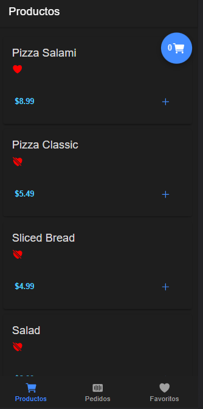

# IONIC - Pizza shoping cart




---

### Description
A shoping cart application simulating a pizza delivery. Add products to the cart, highlight products, place and order and see previous orders.


---

## Use

To run the application, clone the repo, run npm install to get the needed packages and ```ionic serve```  to run it in a local server.

---

## Technologies

- Ionic
- Type Script
- Bootstrap

---
## Author Info

- Linkedin - [Federico Andrés Jácome Castañeda](https://www.linkedin.com/in/federicojacome/)
- Website - [Portfolio](https://federocky.github.io/PersonalWeb/)

[Back To The Top](#read-me-template)
